# Final Submission

Final report here: [Final Report](https://docs.google.com/document/d/1ESunpBGJPEjZkNX6VW0QU9_Pgtv1kqVgfrHsyVDj3Q0/)

### Links

Link to the webstore: http://melon-webstore.herokuapp.com/

Link to admin site: http://melon-webstore.herokuapp.com/admin/

Link to trello: https://trello.com/b/MdkXr2R7/melon-version-1

### Some accounts

- username: developer_l
- password: admin123

#############################
- username: notAdmin
- password: admin123

# Project Plan

| Version |    Date    | Notice |
| ------- | ---------- | --------|
| 0.1     | 21.12.2017 |First version|
| 0.2     | 31.1.2018  | Cart functionality |

## 1. Team
* Linming Pan
* Yi Zhang
* Xiaopu Li

## 2. Goal

In this project, we will build a online game store. 
In the game store, new user can create new account and buy games. 
User can also create Developer account and publish his own game in the store.

## 3. Plans
Our Plan is add features to our game store iteratively. 
We will build version 1.0 where all mandatory features are added to web site.
We are not familiar to Django and we do not know how much time will be need in each feature,
so we decided to do this way (in verions). We will use Trello to manage Tasks.

In section 4, we shows how features will be implemented in not very techical details. 
We use User Case Descriptions to show how function will work in not technical deatils. 
The User Case Descriptions shows what are required, what are out come and so on. 
It also shows the basic sequence how the function will progress.

In next version, we plan to implement 
* Save/load and resolution feature
* Own game
* 3rd party login

We will plan structure of new features later. 

## 4. Features
Following are features we plan to implement in first version.
Person in figure 1 indicates actor. 
Actor is linked to functions that it can interact with.

#### Feature division to Apps

* Account
    * Login
    * Logout
    * Registration
    * Email Confirmation
* Home
    * Home
* Payment
    * Payment Cart
    * Payment Result
* Game
    * Search
    * Game Detaild
    * Play Game
    * Edit Game
* Game Data
    * Save Game
    * Load Game
    * Score
* Collection
    * Collection
    * Inventory

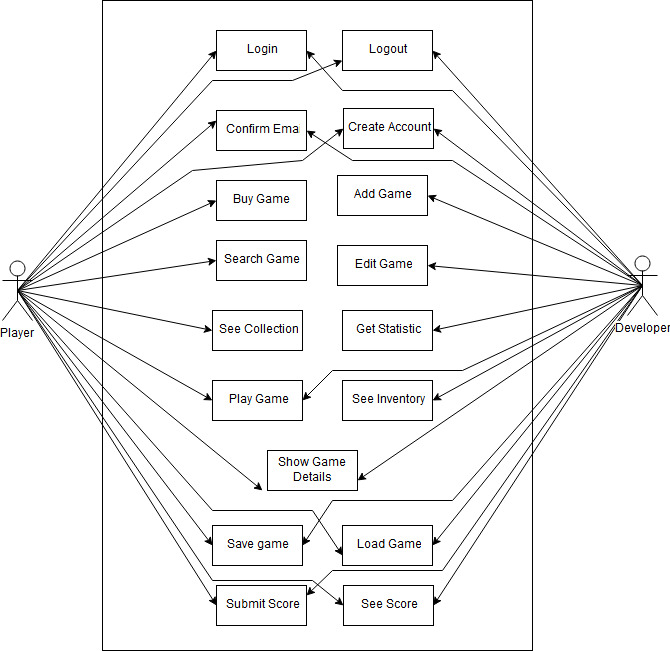

Figure 1

### 4.1 Use Case Descriptions
User = Developer or Player

##### Create Account
|   User Case Desc   |    Create Account      | 
| ------------- |-------------|
|Summary|New user can register.|
|Actor|Any user|
|Precondition|User do not have account yet.|
|View|register view.|
|Basic Seq|<ol><li>Select player or developer</li><li>Type username</li><li>Type email</li><li>Type password</li><li>Confirm password</li><li>Click Register-button</li><li>Redirect to Confirm Email-view</li></ol>|
|Exception|2.Username taken<br\>5. Password not same<br\>|
|Postcondition|New User created|

##### Login
|   User Case Desc   |       Login        | 
| ------------------ |----------------------|
| Summary            |User can login|
| Actor              |User|
| Precondition       |User have not logged in|
|   View             |Login View|
| Basic Seq          |<ol><li>Type Username</li><li>Type password</li><li>Click login-button</li><li>Redirect to Main-view</li></ol>|
| Exception          |3. Username/password not correct|
| Postcondition      |User have logged in|

##### Logout
|   User Case Desc   |      Logout        | 
| ------------------ |----------------------|
| Summary            |User can logout when Usen want|
| Actor              |User|
| Precondition       |User have logged in|
|   View             |Any view|
| Basic Seq          |<ol><li>Click Logout-button</li><li>Confirmation message shows up</li><li>Click Ok-button</li><li>Redirect to Main-view</li><li>Show Logout Success-message</li></ol>|
| Exception          |3. User Click Cancel-button|
| Postcondition      | User have logged out|

##### Buy Game
|   User Case Desc   |      Buy Game        | 
| ------------------ |----------------------|
| Summary            |When Player finds intresting game and he want to buy it. Player uses "Simple Payments" to pay.|
| Actor              | Player|
| Precondition       | Player have logged in, Player do not have the game|
|   View             | Game Details-view|
| Basic Seq          |<ol><li>Click Buy-button</li><li>Redirect to "Simple Payments"</li><li>Confirm payment</li><li>Redirect back to Game Detial-view</li><li>Shows Game Bought-message</li></ol>|
| Exception          |3. Payment failed|
| Postcondition      |Player have the game in this collection|

##### Search Game
|   User Case Desc   |      Search Game        | 
| ------------------ |----------------------|
| Summary            |Using this functionality User can search different games.|
| Actor              |User|
| Precondition       ||
|   View             |Search Game-view|
| Basic Seq          |<ol><li>Type keywords</li><li>Click Search-button</li><li>List of mached games shows up</li></ol>|
| Exception          ||
| Postcondition      |List of matched games|

##### See Collection
|   User Case Desc   |      See Collection        | 
| ------------------ |----------------------|
| Summary            |This functionality shows Player what game he have. And can choose game to play.|
| Actor              |Player|
| Precondition       |Player have logged in, Player are able to click Show Collection-button|
|   View             |Any view, where show Show Collection-button exist|
| Basic Seq          |<ol><li>Click Show Collection-button</li><li>Redirect to See Colletion-view</li><li>Player see only games he owns</li></ol>|
| Exception          ||
| Postcondition      |Player sees games he owns.|

##### Play Game
|   User Case Desc   |      Play Game        | 
| ------------------ |----------------------|
| Summary            |This functionality gives Player play games that he have bought. Developer can use this functionality too to test his own games. |
| Actor              |User|
| Precondition       |User have logged in, User owns the game. And he is in See Game-view or Game Details-view|
|   View             |See Game-view or Game Details-view|
| Basic Seq          |<ol><li>Click Play Game-button</li><li>Redirect to Play Game-view</li><li>Game is loaded</li></ol>|
| Exception          |1. Player do not own the game|
| Postcondition      |Game is loaded to browser and User can play|

##### Save game
|   User Case Desc   |      Save Game        | 
| ------------------ |----------------------|
| Summary            |This functionality available user to save his progress in the game. Not all game have this functionality|
| Actor              |User|
| Precondition       |Player have logged in, The game is loaded|
|   View             |Play Game-view|
| Basic Seq          |<ol><li>Click Save-button</li><li>Saved-Message show up</li></ol>|
| Exception          |1. The game do not have this button <br\> 2. Save failed, Error-message|
| Postcondition      |Save data is stored to Users account|

##### Load Game
|   User Case Desc   |      Load Game        | 
| ------------------ |----------------------|
| Summary            |This functionality available user to load his progress in the game. Not all game have this functionality|
| Actor              |User|
| Precondition       | Player have logged in, the game is loaded|
|   View             |Play Game-view|
| Basic Seq          |<ol><li>Click Load-button</li><li>Loaded-Message show up</li></ol>|
| Exception          |1. The game do not have this button <br\> 2. Load failed, Error-message|
| Postcondition      |The save is loaded and User can continue his game|

##### Submit Score
|   User Case Desc   |      Submit Score        | 
| ------------------ |----------------------|
| Summary            |User can submit his score to Score Board where he can see his score and ranking.|
| Actor              |User|
| Precondition       |User have logged in, User have got some score in the game|
|   View             |Play Game-view|
| Basic Seq          |<ol><li>Click Submit-button</li><li>Update Score Board</li><li>See new Score Board</li></ol>|
| Exception          |1. The game do not have this button <br\> 1. Submit failed, show error-message
| Postcondition      |User can see his ranking in the Score Board.|

##### Add Game
|   User Case Desc   |      Add Game        | 
| ------------------ |----------------------|
| Summary            | Developer can add games|
| Actor              | Developer|
| Precondition       | Logged in as Developer User, The Game is not added before|
|   View             | Inventory view|
| Basic Seq          |<ol><li>Click Add New Game-button</li><li>Redirect to add new game-view</li><li>Type Game Name</li><li>Type Game Descriptionc</li><li>Type Url</li><li>Add image</li><li>Type Price</li><li>Click Save-button</li><li>Shows Success-message</li></ol>|
| Exception          |4.Url used   5. add format not correct   6. Some input field empty|
| Postcondition      | New game added to game store|
| Notice             | Only Developer can access this. |

##### See Inventory
|   User Case Desc   |      See Inventory        | 
| ------------------ |----------------------|
| Summary            | Developer can see all game he owns.|
| Actor              | Developer |
| Precondition       | Logged in as Developer User|
|   View             | Any view, where show Show Inventory-button exist |
| Basic Seq          |<ol><li>Click Show Inventory-button</li><li>Redirect to Inventory-view</li><li>Developer see list of Games he owns</li></ol>|
| Exception          ||
| Postcondition      | Developer see Games he owns|

##### Edit Game
|   User Case Desc   |      Edit Game        | 
| ------------------ |----------------------|
| Summary            | Developer can edit Games he owns. eg. change price. |
| Actor              | Developer |
| Precondition       | Developer have logged in and owns the game|
|   View             | Inventory-view |
| Basic Seq          |<ol><li>Click Edit-button of the Game</li><li>Redirect to Edit Game-view</li><li>Edit Fields</li><li>Click Save</li></ol>|
| Exception          |3. Click Cancel-button|
| Postcondition      | Game data is edited|

##### See Statistic
|   User Case Desc   |      See Statistic        | 
| ------------------ |----------------------|
| Summary            | Developer can see statistic of all of game he owns.  |
| Actor              | Developer|
| Precondition       | Logged in as Developer|
|   View             |  |
| Basic Seq          |<ol><li>Click Show Statistic-button</li><li>Redirect to Statistic-view</li><li>See list of statistic of games</li></ol>|
| Exception          ||
| Postcondition      | Developer can see list of statistic of games he owns. Data he can see: <ul><li>name of the game</li><li>number of game sold</li><li>total sale</li><li>date of last sold game</li></ul>|

##### Confirm Email
|   User Case Desc   |      Confirm Email        | 
| ------------------ |----------------------|
| Summary            | When User creates new account, he have to confirm his email. Web site will send an email, where the User have to click a link.|
| Actor              | User |
| Precondition       | User have created new account |
|   View             | Confirm Email-view|
| Basic Seq          |<ol><li>Website sends an email to user</li><li>User clicks link in the email</li><li>Link redrect User back to website main-view with message showing "email confirmed"</li></ol>|
| Exception          | 1. User wrote wrong email, and never recieve it   2. User clicks outdated link   2. User clicks already used link |
| Postcondition      | Email of the User is confirmed |

##### See Score
|   User Case Desc   |      See Score        | 
| ------------------ |----------------------|
| Summary            |User can see top score of the game|
| Actor              | User|
| Precondition       | Game Details-view or Play Game-view |
|   View             | Score Board -block|
| Basic Seq          |<ol><li>Request update Score board</li><li>Update Score Board</li></ol>|
| Exception          ||
| Postcondition      | Score Board Updates|

##### Template
|   User Case Desc   |      Template        | 
| ------------------ |----------------------|
| Summary            ||
| Actor              ||
| Precondition       ||
|   View             ||
| Basic Seq          |<ol><li>A</li><li>B</li><li>C</li></ol>|
| Exception          ||
| Postcondition      ||

### 4.2 DataBase Models

Here we show how we plan to implement models in our project. 
We use some base models provided by Django, eg User and Authentication.

###   Account User   (Auth User)
We will extend Auth User model to have activation field.

|     Field     |    type    | other |  comment  |  example  |
| ------------- |:----------:| ----- | :-------- | :-------- |
| activation    | bit || if accout is activited ||1|

###   Payment Cart   
We will extend Auth User model to have activation field.

|     Field     |    type    | other |  comment  |  example  |
| ------------- |:----------:| ----- | :-------- | :-------- |
| id   (pk)     | int        |       |  |1|
| user       | ForeignKey |       |  |1|
| activity      | bit        |       | indicate if is in use |1|
| total_price   | number     |       | total price |49.300|
| total_qty     | int        |       | total quantity |12|

###   Payment Cart Item

|     Field     |    type    | other |  comment        |  example  |
| ------------- |:----------:| ----- | :--------       | :-------- |
| cart       | ForeignKey    |       | Cart id         |     12     |
| game       | ForeignKey    |       | game id         |     23    |
| qty       | ForeignKey    | default=1  | quantity of item         |     1    |
| subtotal       | number    |   |          |     9.900    |

###   Group   (Auth Group)
Django model

###   User Group   (Auth User Group)
Django model

###   Game Game 
This model is used to save data about games.

|     Field     |    type    | other |  comment  |  example  |
| ------------- |:----------:| ----- | :-------- | :-------- |
| owner     | ForeignKey | |owner of the game |3|
| name          | char 255   | |name of the game |Snake 2|
| description   | text       | |description of the game |Snake 2, a classic game played...|
| url           | url        | unique|url to the game | www.something.fi/somthing/game |
| image url     | FileField  | nullable|Path to image loaded by developer|  games/images/snake2.png|
| price         | number     | default=0|peicw of the game |4.900|
| available     | bit        | default=0|if game is available in store |1|

###   Collection Collection  
This model is for data to save games that Player Group Users have.

|     Field     |    type    | other |  comment  |  example  |
| ------------- |:----------:| ----- | :-------- | :-------- |
| owner      | ForeignKey ||  ||
| game       | ForeignKey | | ||

###   Payment Transaction   
This model is for saving all transactions that Player User Group have made. 
This is also where Developer User Group can see their statistic about sales.

|     Field     |    type    | other |  comment  |  example  |
| ------------- |:----------:| ----- | :-------- | :-------- |
| buyer      | ForeignKey || owner of the game |12|
| game       |  char 255  || name of the game |4|
| price         |   number   || category of the game |9.900|
| date          | dateTime   || buy date | 2017-12-11 |

###   Game Save  
This model is to save Player User Groups game save data.
 
|     Field     |    type    | other |  comment  |  example  |
| ------------- |:----------:| ----- | :-------- | :-------- |
| user       |  ForeignKey| |  |
| game       |  ForeignKey| |  |
| data          | text|      | save data in json | {data:"something"} |

###   Game Category  
This model if for categories of games. Only category name.
 
|     Field     |    type    | other |  comment  |  example  |
| ------------- |:----------:| ----- | :-------- | :-------- |
| id            | int        | | pk  |
| name          | char255    | unique| name of category | action |

###   Game Game Category   
This model is for connecting game to categories.

|     Field     |    type    | other |  comment  |  example  |
| ------------- |:----------:| ----- | :-------- | :-------- |
| game       | ForeignKey ||  ||
| category   | ForeignKey ||  ||

###   Account Email Confirmation  
This model contains all email confirmation sent to User

|     Field     |    type    | other |  comment  |  example  |
| ------------- |:----------:| ----- | :-------- | :-------- |
| user       | ForeignKey ||  |12|
| email         | emailField ||  |teemu.teekkari@tkk.fi|
| code          | char255    ||code that is in link sent to user | x93kdmfjke2ow3m4tc833mfieki29kdurmc829pfr|
| expire        | datetime   ||date when code will expire |20-02-2018:20:20|
| used          | bit        |default=0| Tells if code is used | 0|

### 4.3 Structure

#### Account Control System

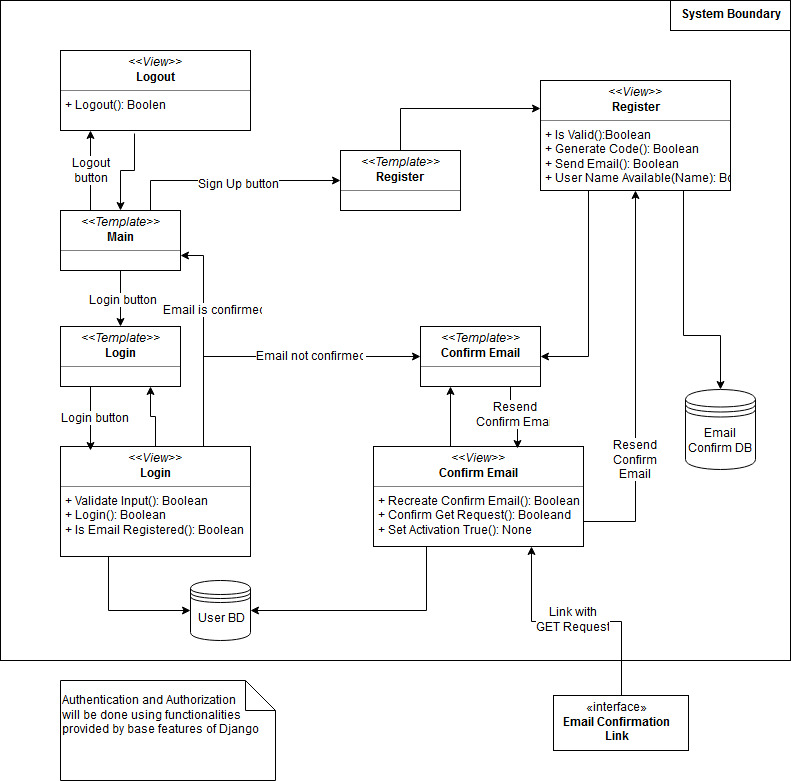

#### Inventory System

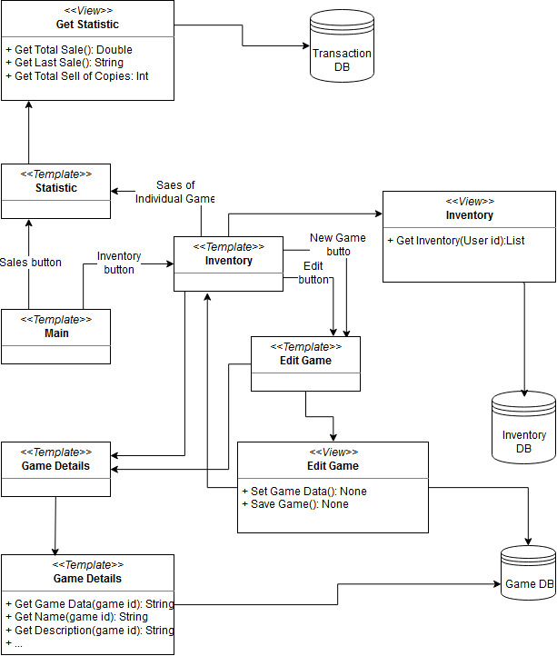

#### Collection and Play Game System

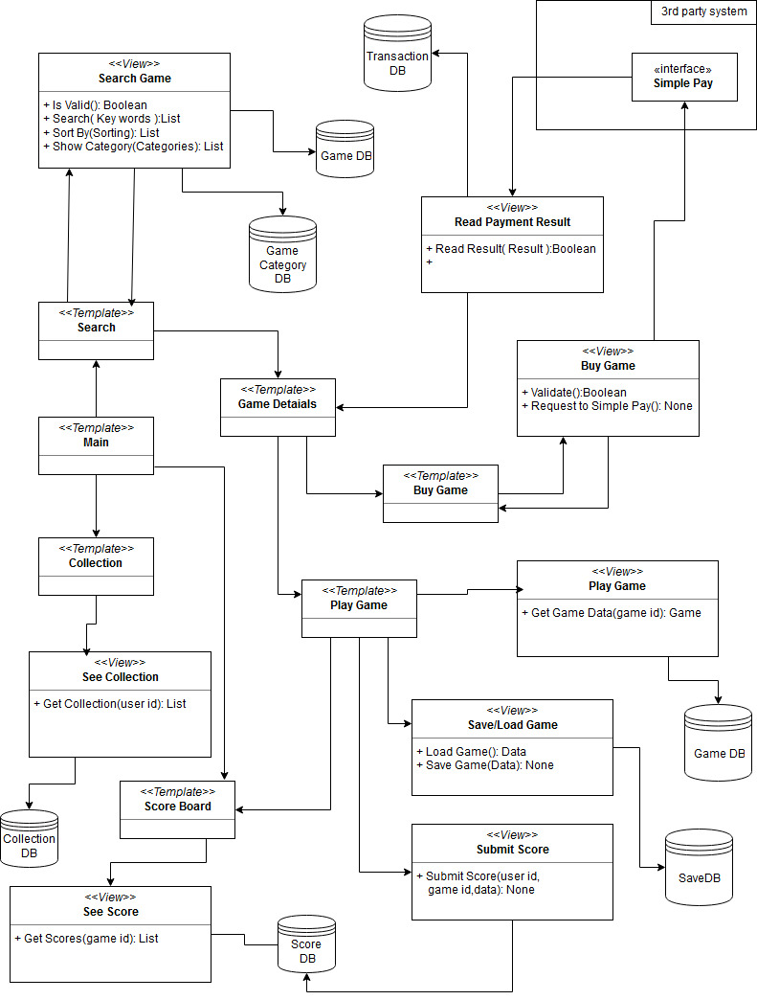

## 5 Views

#### 5.1 Views

##### Main page view (index)
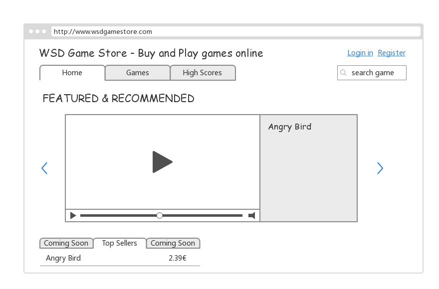
##### Register view
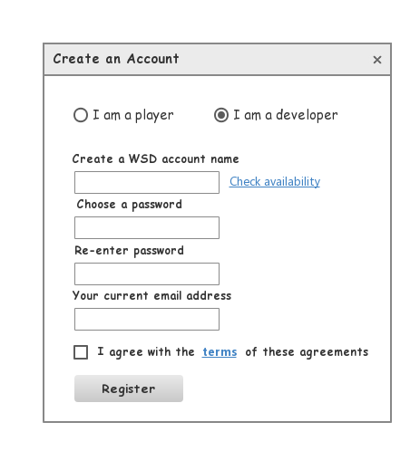
##### Confirm Email view
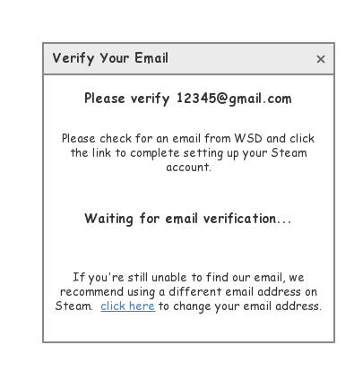
##### Login view
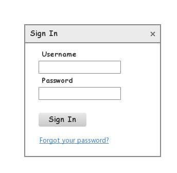
##### Collection view
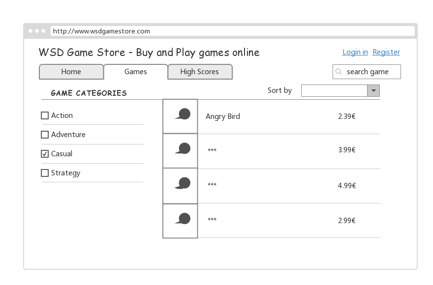
##### Inventory view (Developer User Group)
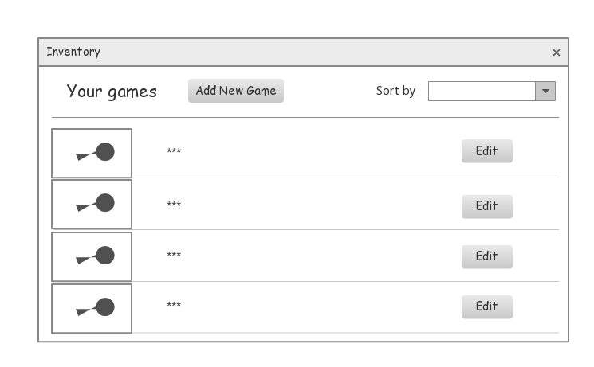
##### Edit Game view (Developer User group)
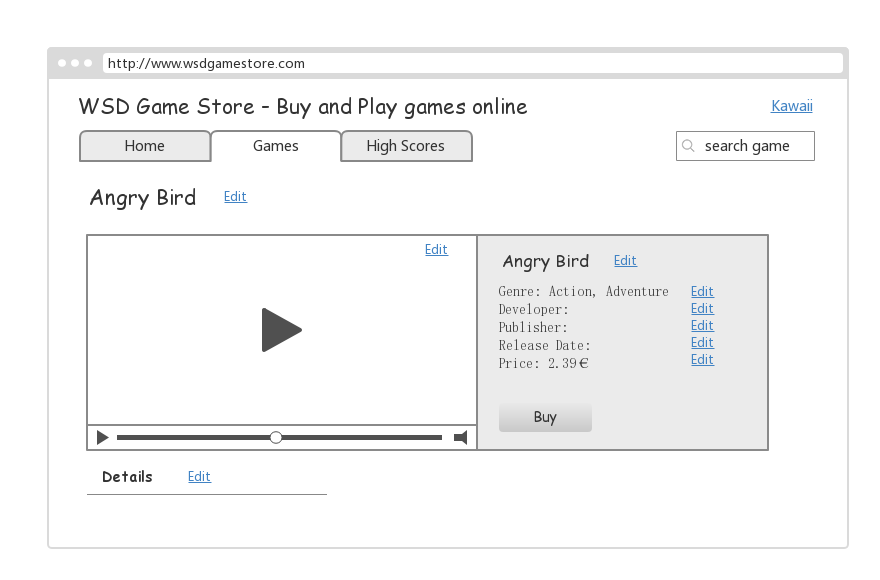
##### Statistic view (Developer User Group)
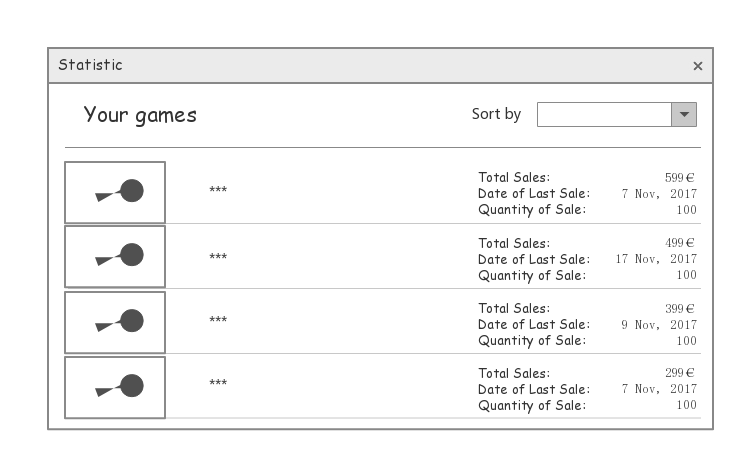
##### Buy Game view
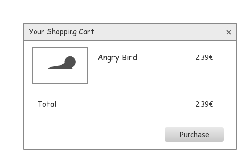
##### Search Game view
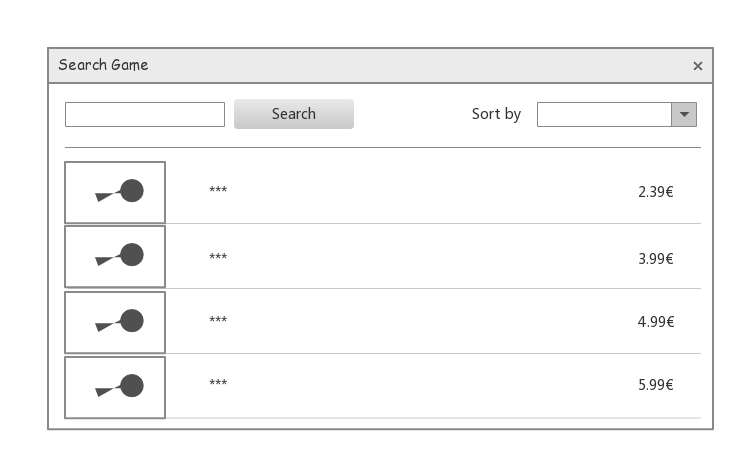
##### Game Details view
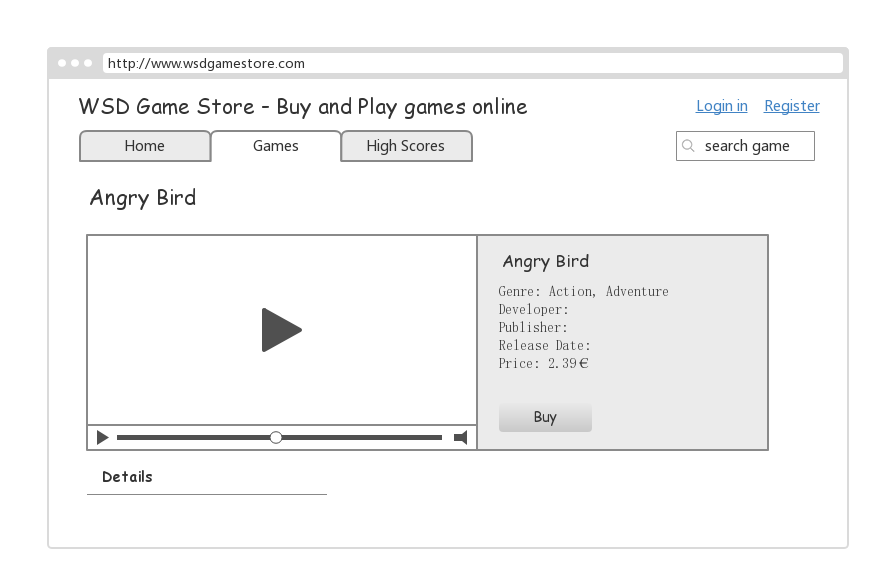
##### Play Game view
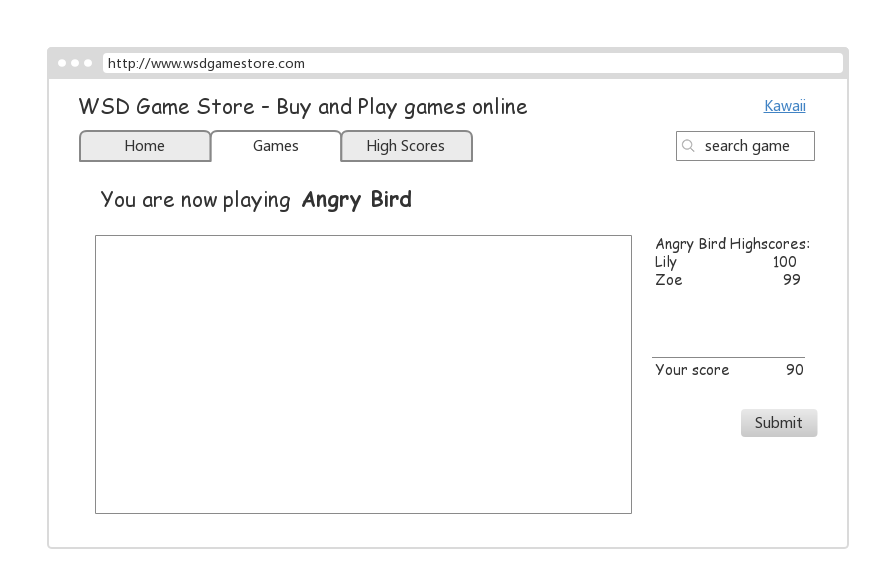
#### 5.2 Blocks
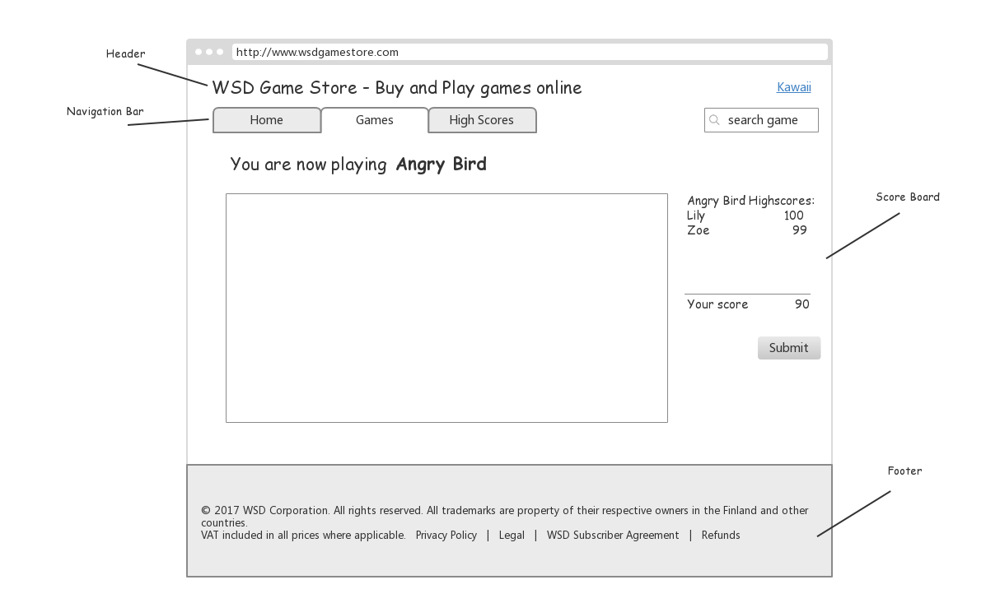
##### Header

##### Navigation Bar

##### Footer

##### Score Board 

## 6. Process and Time Schedule

### 6.1 Process
##### 1.Project management and responsibilities
Project manager : Linming Pan.
Project manager is responsible for that everything is done by due dates set by course staff. 
Manager is also responsible for making decisions when there is no mutual agreement about some issue.

Project Management Tool: Trello
##### 2.Project Meetings
At least, once a week.

##### 3.Communication plan
Communication Tools : Wechat, SLACK.
### 6.2 Schedule
Week 51: Plan

Week 52: Vacation

Week 1: Login, Logout, Comfirm Email, Create Account

Week 2: Navigation footer and layout

Week 3: Buy Game, Add Game, Edit Game, See inventory, Show Game details

Week 4: Play Game, Save game, Submit Score

Week 5: Testing

Week 6: Testing

Week 7: Planning and Implementing of Version 2

Week 8: Test Version 2

## 7. Testing

We use User Case Description to test each functionality. We have provided exceprions and post conditions in Use Case Description.

## 8. Risk Analysis

We have to analyse risks that may occur to our website, 
especially since we are building a web store.
Here are our plan to deal with common vulnerabilities. 
Fortunately Django have protection against most of attacks.

#### User Input
The most common way to attack website is throught user input. 
The user input should never be trusted.
We have to validate all user input fields.

#### Cross-site Scripting
Preventing XSS attack, basic defense is input validation. 
Which we plan do to all input fields. 
Django templates also protects against  the majority of XSS attacks

#### Session hacking
For session hacking, Django do not have full protection. 
Django have different session types: 
database-backed session, cached session, file-based session and cookie-based session.
We plan to use database-backed session first, since it is safest for Django beginner.
At the starting of the game store, there will not be much user. 
So we can assume there will not be performance problems in django sessions. 
The second plan is using cookie-based session. 
This have better performance only in very large scale.

#### Cross Site Request Forgery
Django have protection against CSRF.

#### SQL Injection
We plan to do input validation. So this is protected. 
Django ORM also protects this, so we have double protection.

#### Clickjacking Protection
Django also have this protection

#### Security in Django
[Security in Django](https://docs.djangoproject.com/en/2.0/topics/security/)
